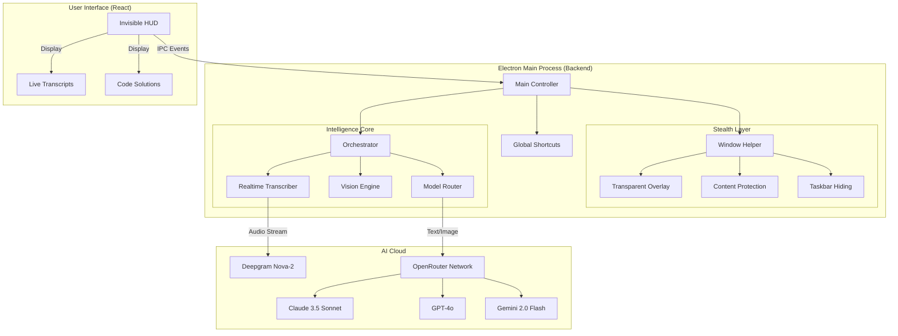

# <div align="center">CodeGuru: The Invisible Interview Wingman 🦅</div>

<div align="center">


**State-of-the-Art AI Assistance • Zero Latency • Completely Invisible**

</div>

---

## 🚀 Overview

**CodeGuru** is an advanced, stealth-focused AI assistant designed specifically for technical interviews. It sits invisibly on your desktop, listening to your interview in real-time and analyzing your screen to provide instant, accurate answers to coding problems and behavioral questions.

Unlike other tools, CodeGuru is built with a **"Privacy First, Stealth First"** architecture. It uses system-level hooks to remain invisible to screen sharing software (Zoom, Teams, Meet) while keeping you fully informed.

## ✨ Key Features

*   **👻 True Invisibility**: Uses OS-level content protection to be invisible to screen capture software.
*   **⚡ Real-Time Audio Intelligence**: Transcribes interviewer speech instantly and suggests confident, concise answers.
*   **👁️ Omni-Model Vision**: Captures coding problems from your screen and solves them using an orchestration of top-tier AI models (Claude 3.5, GPT-4o, Gemini 2.0).
*   **🧠 Blockchain Expert Persona**: Specialized knowledge base for blockchain, cryptography, and smart contract interviews.
*   **🎹 Global Stealth Shortcuts**: Control everything via keyboard without ever touching the mouse.

---

## 🛠️ Architecture

CodeGuru uses a sophisticated multi-process architecture to ensure speed and stability.



---

## 📥 Installation & Setup (Windows 11)

### 1. Prerequisites
*   **Node.js (v18+)**: [Download Here](https://nodejs.org/)
*   **Git**: [Download Here](https://git-scm.com/download/win)

### 2. Quick Start
Open PowerShell and run:

```powershell
# Clone the repository
git clone https://github.com/MrDecryptDecipher/codeguru.git
cd codeguru

# Install dependencies
npm install

# Create configuration
New-Item -ItemType File -Name .env
```

### 3. Configuration
Open the `.env` file and add your keys:

```env
# Real-time Audio Transcription
DEEPGRAM_API_KEY=your_deepgram_key

# AI Model Orchestration
OPENROUTER_API_KEY=your_openrouter_key
```

### 4. Launch
```powershell
# Run in Developer Mode
npm run app:dev

# OR Build Standalone Executable
npm run app:build
```

---

## 🎮 Usage Guide

### The "Invisible" Overlay
The app runs as a transparent layer on top of your screen. It is **always on top** but **click-through** when hidden.

| Command | Shortcut | Action |
| :--- | :--- | :--- |
| **Toggle HUD** | `Ctrl + B` | Shows/Hides the assistant overlay. |
| **Solve Problem** | `Ctrl + H` | Captures screen, analyzes code, and provides solution. |
| **Quick Solve** | `Ctrl + Enter` | Instantly processes the last captured screenshot. |
| **Reset** | `Ctrl + R` | Clears history and resets the AI context. |
| **Move Window** | `Ctrl + Arrows` | Repositions the overlay without using the mouse. |

### Workflow
1.  **Interview Starts**: Press `Ctrl + B` to show the HUD. Click **"Start Listening"**.
2.  **Verbal Questions**: The AI listens and instantly suggests short, punchy answers in the "Suggested Reply" box.
3.  **Coding Challenge**: When the interviewer presents a problem:
    *   Press `Ctrl + H`.
    *   The AI captures the problem, OCRs the text, and generates a full solution with complexity analysis.
    *   Read the solution and type it out confidently.

---

## 🛡️ Security & Privacy

*   **Local Processing**: Screenshots are processed in memory and never saved to disk unless debug mode is on.
*   **Ephemeral Context**: Conversation history is kept only for the duration of the session.
*   **Anti-Cheat Detection**: The window uses OS-level flags (`setContentProtection`) to prevent detection by proctoring software that takes screenshots.

---

<div align="center">

**Built for the 1% of Engineers.**

</div>
